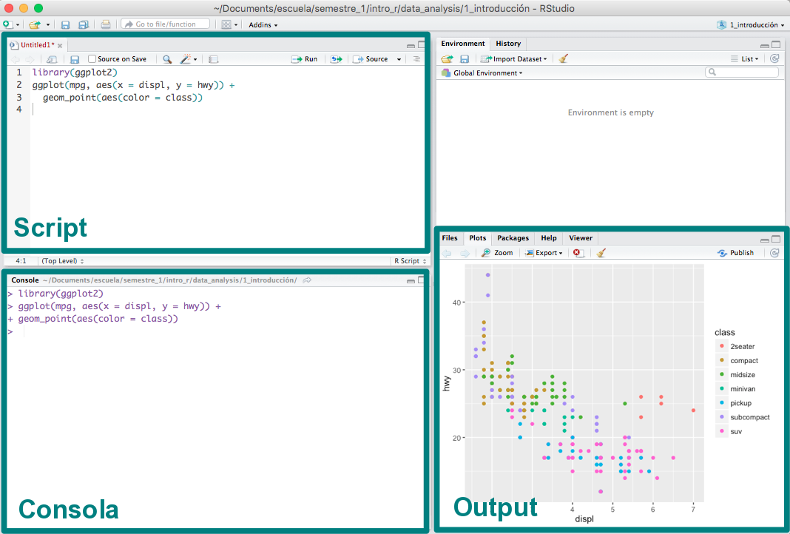
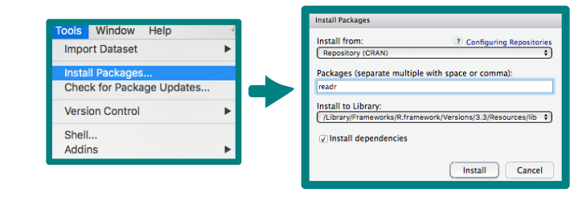
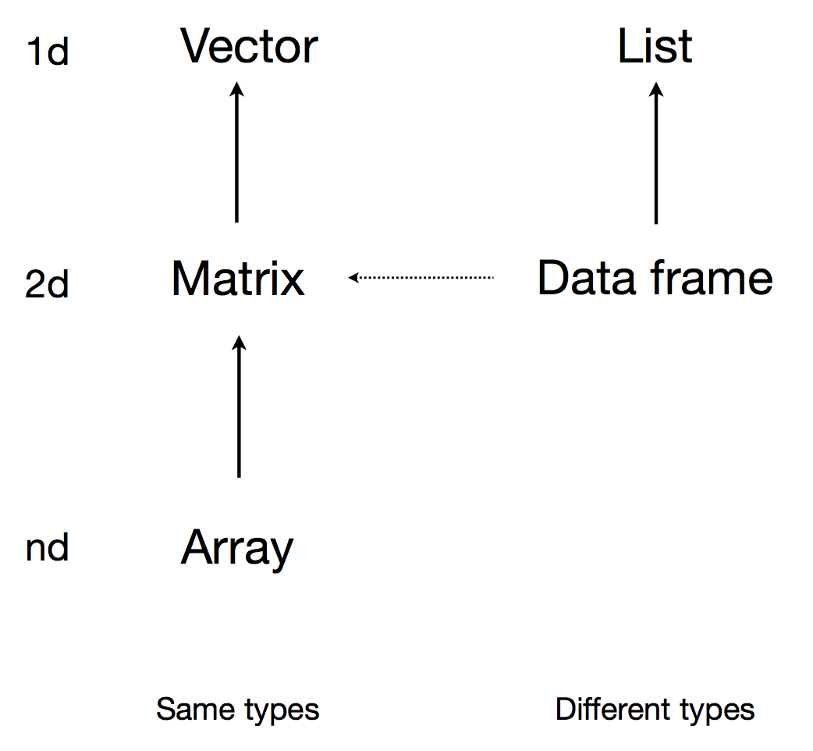

```{r setup, include=FALSE}
knitr::opts_chunk$set(warning = FALSE, message = FALSE)
```


---

> Las notas de este curso introductorio 
> están basadas en el material de los profesores Ernesto Barrios, Andreu Boada,
> Luis Felipe González y Teresa Ortiz.
> Así como en el tutorial del Hadley Wickham y Garret Grolemund
> “R for Data Science”.

---

## Temario del Taller

En el taller cubre tres temas principales que se 
estudiarán uno por semana. 


### I. Introducción a R

* _readr_
* _stringr_
* _lubridate_

### II. Visualización

* _ggplot2_

### III. Manipulación de datos

* _tidyr_
* _dplyr_


La intención del taller es mostrar herramientas/librerías 
específicas que faciliten realizar el análisis de datos a 
nivel descriptivo. 

<br>

---

## 0. El ambiente y el lenguaje R

##### ¿Qué es R?
* R es un lenguaje de programación y un ambiente de cómputo estadístico
* R es software libre (no dice qué puedes o no hacer con el software), de código 
abierto (todo el código de R se puede inspeccionar - y se inspecciona).
* Cuando instalamos R, instala la base de R. Mucha de la funcionalidad adicional 
está en **paquetes** que la comunidad contribuye.

##### ¿Cómo entender R?
* Hay una sesión de R corriendo. La consola de R es la interfaz 
entre R y nosotros. 
* En la sesión hay objetos. Todo en R es un objeto: vectores, tablas, 
 funciones, etc.
* Operamos aplicando funciones a los objetos y creando nuevos objetos.

##### ¿Por qué R?
* R funciona en casi todas las plataformas (Mac, Windows, Linux e incluso en 
Playstation 3).
* R es un lenguaje de programación completo, permite desarrollo de DSLs.
* R promueve la investigación reproducible.
* R está actualizado gracias a que tiene una activa comunidad. Solo en CRAN hay 
cerca de 4000 paquetes (funcionalidad adicional de R creadas creada por la 
comunidad).
* R se puede combinar con otras herramientas.
* R tiene capacidades gráficas muy sofisticadas.
* R es popular ([la guerra del software](http://datacamp.wpengine.com/wp-content/uploads/2014/05/infograph.png)).

### Descargar R 
Para comenzar se debe descargar [R](https://cran.r-project.org), esta descarga 
incluye R básico y un editor de textos para escribir código. 

Se descarga de CRAN o **Comprenhensive R Archive Network** que es una colección
de sitios que tienen el mismo material como distribuciones de R, documentación 
y binarios. El master está en Austria, de ahí se "espeja" (mirrors) a muchos
sitios de internet alrededor del mundo. Para México está disponible 
el espejo del ITAM y el del Colegio de Posgraduados (Texcoco)
(https://cran.r-project.org/mirrors.html).


### Descargar RStudio
Después de descargar R se recomienda descargar
[RStudio](https://www.rstudio.com/products/rstudio/download/) (gratis y libre).
RStudio es un ambiente de desarrollo integrado para R: incluye una consola, un 
editor de texto y un conjunto de herramientas para administrar el espacio de 
trabajo cuando se  utiliza R. 




<br>

Algunos _shortcuts_ útiles en RStudio son:

**En el editor**  

* command/ctrl + enter: enviar código a la consola  
* ctrl + 2: mover el cursor a la consola

**En la consola**  

* flecha hacia arriba: recuperar comandos pasados  
* ctrl + flecha hacia arriba: búsqueda en los comandos  
* ctrl + 1: mover el cursor al editor  


**Más**

* alt + shift + k: muestra los _shortcuts_ disponibles.


<br>
<br>

---

## 1. Introducción

El objetivo de usar [R](https://cran.r-project.org) es realizar 
análisis de datos.
En el análisis de datos nos interesan técnicas cuantitativas cómo: recolectar, 
organizar, entender, interpretar y extraer información de colecciones de 
datos predominantemente numéricos.
Hadley Wickham resume estas tareas en el proceso de 
análisis en el diagrama siguiente:


<!--  -->

\quad

El objetivo de este taller es no sólo introducir [R](https://cran.r-project.org), 
además mostrar las herramientas más importantes para
realizar análisis de datos.

### R Packages

Una de las ventajas de [R](https://cran.r-project.org) es
la gran comunidad que aporta al desarrollo por 
medio de paquetes que dan funcionalidad adicional. 
Esta es la mejor manera de usar [R](https://cran.r-project.org)
para análisis de datos.

Existen dos formas de instalar paquetes:

* Desde RStudio:



* Desde la consola:

```{r install_packages, eval=F}
install.packages('readr')
```

Una vez instalados los paquetes, 
se cargan a la sesión de [R](https://cran.r-project.org)
mediante `library`. Por 
ejemplo, para cargar el paquete `readr` que instalamos
anteriormente, hacemos:

```{r library}
library('readr')
print(read_csv)
```
Como el paquete `readr`está cargado en la sesión podemos llamar a la función
`read_csv` que se usará más adelante. 

Los paquetes básicos que se recomiendan para análisis de datos
y que utilizaremos son:

1. `readr` y `readxl` para leer datos
2. `tidyr` manipulación de datos
3. `lubridate` para  manejar fechas
4. `stringr` para manipular caracteres
5. `dplyr` filtros, cálculos y agregación de datos.
6. `ggplot2` graficar


**Importante**: Los paquetes se instalan una vez únicamente después de descargar
una nueva versión de [R](https://cran.r-project.org)](https://cran.r-project.org). Las librerías 
se carga en cada sesión de [R](https://cran.r-project.org) nueva. 


> `Ejercicio`: Instala y carga en tu computadora los paquetes que se
enlistaron antes.

> `Respuesta`: 

```{r, echo = T, eval=FALSE}
# 1a. Una forma de instalar las librerías
install.packages(readr)
install.packages(readxl)
install.packages(lubridate)
install.packages(stringr)
install.packages(tidyr)
install.packages(dplyr)
install.packages(ggplot)

# 1b. Forma alternativa de instalar las librerías (recursivo)
libs.install <- c('readr', 'readxl', 'lubridate', 'tidyr', 'stringr', 
  'dplyr', 'ggplot2')
sapply(libs.install, install.packages)

# 2. Cargar las librerías
library(readr)
library(readxl)
library(lubridate)
library(stringr)
library(tidyr)
library(dplyr)
library(ggplot)
```


<br>
<br>

### Ayuda en R

Existen diferentes formas de pedir ayuda en [R](https://cran.r-project.org).

* `help.start()`: ayuda en general
* `help(fun)` o `?fun`: ayuda sobre la función *fun*
* `apropos("fun")`: lista de funciones que contiene la palabra *fun*
* `example(fun)`: muestra un ejemplo de la función *fun*

```{r ejemhelp, eval = F}
help(read_csv)
?read_csv2
```

En [R](https://cran.r-project.org) existen viñetas o *vignettes* que 
incluyen documentación de temas o funciones sobre el paquete y en ocasiones 
describen ejemplos. Para consultar viñetas:

* `vignette()`: muestra las viñetas disponibles sobre los paquetes instalados.
* `vignette("foo")`: muestra la viñetas del paquete *foo*.

```{r ejemvignette, eval = F}
vignette()
vignette('ggplot2-specs')
```

Si lo anterior no funciona se presentan los siguientes recursos:

- Buscar ayuda: Google, [StackOverflow](http://stackoverflow.com/questions/tagged/r).

- [Cheat sheets de RStudio](https://www.rstudio.com/resources/cheatsheets/)

- Para aprender programación avanzada en [R](https://cran.r-project.org), el libro gratuito 
[Advanced R](http://adv-r.had.co.nz/) de Hadley Wickham 
es una buena referencia. En particular es conveniente leer 
la guía de estilo (para todos: principiantes, intermedios y avanzados).

- Para mantenerse al tanto de las noticias de la comunidad de 
[R](https://cran.r-project.org) pueden visitar [R-bloggers](http://www.r-bloggers.com/).

- Para entretenerse en una tarde domingo pueden navegar 
los reportes en [RPubs](https://rpubs.com/).


<br>
<br>

---

### 2. Estructuras de datos

En [R](https://cran.r-project.org) se puede trabajar con 
distintas estructuras de datos, algunas son de una
sola dimensión y otras permiten más, como indica el diagrama 
siguiente:



En este tutorial, se trabajará principalmente con *vectores* y *data frames*.


<br>

#### a. Vectores

Los vectores son estructras de datos de una dimensión. 
Un vector se define con
la función `c()`, que concatena diferentes elementos del 
mismo tipo, esto determina el tipo del vector.


**Nota:** En R, la asignación de un nombre al vector, 
o en general a cualquier objeto, 
se realiza con el símbolo `<-`. Se recomienda usar
el shortcut  **alt -** genera `<-`.

<br>


##### Tipos de vectores

Los vectores en [R](https://cran.r-project.org) pueden ser de diferentes 
tipos o clases, a continuación se presentan algunos casos. 
En R, la clase de cada vector se extrae con la 
función `class`()

*  __Vectores numéricos__:
```{r vecnum, message=FALSE, warning=FALSE}
a <- c(1,2.5,3,4.5,5,6.9)
a
# clase del vector
class(a)
```


* __Vectores lógicos__:
```{r vecbool}
bool <- c(T, F, TRUE, FALSE)
bool
# clase del vector
class(bool)
```

* __Vectores de caracteres__:
```{r vecchar}
fruits <- c("apple", "banana", "orange", "pineapple", "lemon", "kiwi")
fruits
class(fruits)
```

Para la manipulación de caracteres es recomendable 
el paquete **stringr** que permite realizar operaciones
sobre este tipo de elementos. Más adelante se presenta un 
ejemplo.

<br>


##### Elementos de vectores

La **selección de elementos** de un vector se realiza con **`[ ]`** para
indicar la posición. A diferencia de otros lenguajes de programación 
las posiciones en R incian en 1.

```{r posiciones}
# elemento en la posición 1
fruits[1]
# elemento en la posición 1 y 5
fruits[c(1,5)]
```

<br>
En R es posible extraer un valor del vector indexándolo con 
posiciones negativas:
```{r posicionesnegativas}
# omitir el elemento en la primera posición
fruits[-1]
```

<br>

Una característica particular de vectores en R, es 
que cada elemento puede ser nombrado. Para hacer esto 
se usa la función `names()`. 
Por ejemplo, al vector *fruits*
agregemos el nombre en español de la fruta para 
como el nombre de cada elemento. 

```{r namesvect}
names(fruits) <- c('manzana', 'platano', 'naranja', 'piña', 'limón', 'kiwi')
fruits
# cada elemento tiene un nombre asignado
fruits[5]
```

<br>

Para eliminar los nombres asignados a cada elemento, se asigna
`NULL` a los nombres del vector:
```{r, echo=F}
names(fruits) <- NULL
names(fruits)
fruits
```


<br>

`Ejemplo`: Del vector de
seis frutas diferentes llamado *fruits*, 
localiza únicamente las frutas que 
tengan la letra **w**.

```{r stringrejem, warning=F, message=F}
# Cargamos la librería
library(stringr)
fruits <- c("apple", "banana", "orange", "pineapple", "lemon", "kiwi")
fruits
```

Esto es posible con la función `str_detect()`, que regresa 
un vector booleano para cada elemento del vector donde encontró
el patron **w**. 

```{r stringrejem3, warning=F, message=F}
str_detect(fruits, pattern = 'w')
```

Ahora, seleccionamos únicamente los elementos del vector
que tienen la letra **w**:
```{r stringrejem4, warning=F, message=F}
# Selecciona el elemento con valor TRUE: kiwi
fruits[str_detect(fruits, pattern = 'w')]
```


<br>


> `Ejercicio`: ¿Qué realiza el siguiente código?
En particular la función `str_order()`?

```{r stringrejem5, warning=F, message=F}
fruits[str_order(fruits)]
```

> `Respuesta`:

```{r stringrejem6, warning=F, message=F}
# Ordena alfabéticamente los elementos del vector fruits
```


<br>
<br>


##### Operaciones de vectores

En [R](https://cran.r-project.org) las **operaciones de vectores**
son componente a componente. 

- Sumas, multiplicaciones y potencias:
```{r vecops1}
# Suma del vector longitud 6 y un vector longitud 1
a <- c(1, 2.5, 3, 4.5, 5, 6.9)
b <- 1
a + b 
```

```{r vecops2}
# Multiplicaciones componente a componente misma longitud
a <- c(1, 2.5, 3, 4.5, 5, 6.9)
a*a
```
```{r vecops}
# Multiplicaciones y potencias
a <- c(1, 2.5, 3, 4.5, 5, 6.9)
c <- (a^2 + 5)*3
c
```

<br>

- Comparaciones: En este tipo de operación se obtiene
un vector lógico dependiendo si la condición 
se cumple o no. 

```{r veccomps1}
# Comparar el vector dado un valor específico
a > 3 
a[a > 3] # únicamente elementos que cumple la condicion de ser mayores a 3
fruits != 'apple'
fruits[fruits != 'apple'] # únicamente elementos que no son apple
```

```{r veccomps}
# Comparar el vector dado otro vector de la misma dimensión
x <- c(1, 2, 3, 4, 5, 6)
a == x
a[a == x] # unicamente los elementos iguales y en la misma posición entre a y x
```

<br>

- Funciones predeterminadas: 

Algunas funciones predeterminadas del paquete básico de R son muy útiles
para la manipulación de vectores y el análisis de datos.
A continuación se enlistan algunas 
de las más comúnes:

* `length`: número de elementos en el vector
* `class`: clase del vector
* `summary`: resumen de información del vector
* `unique`: valores unicos del vector
* `table`: tabla de frecuencias para cada elemento del vector
* `sum`: suma de los elementos del vector
* `mean`: promedio de elementos del vector
* `sd`: desviación estándar de los elementos del vector
* `cumsum`: suma acumulada de elemento anterior del vector


> `Ejercicio`: Apliquen las funciones comúnes enlistadas antes
en el vector  `x <- c(1, 2, 3, 4, 5, 6)`

> `Respuesta`: 

```{r, eval= T, echo = T}
x <- c(1, 2, 3, 4, 5, 6)
length(x) # número de elementos en el vector
class(x) # clase del vector
summary(x) # resumen de información del vector
unique(x) # tabla de frecuencias para cada elemento del vector
table(x) # tabla de frecuencias para cada elemento del vector
sum(x) # suma de los elementos del vector
mean(x) # promedio de elementos del vector
sd(x) # desviación estándar de los elementos del vector
cumsum(x) # suma acumulada de elemento anterior del vector
```


<br>

##### Otros tipos de vectores: 

Existen tipos de vectores con características 
importantes:

* __Secuencias__: los vectores 
de secuencias se pueden crear con 
la función `seq()` o con `:`, 
de la siguiente forma:

```{r secuencias}
# secuecia de 1 al 10 
1:10
# secuecia de pares de 0 al 10 
seq(0, 10, by = 2)
```

<br>

* __Vectores de fechas__: se pueden hacer operaciones y 
algunas funciones definidas de fechas. El paquete _lubridate_ 
permite manejar fechas con mayor facilidad.


Se incia la secuencia el 08 de agosto de 2016 y 
se asigna la clase de fecha con la función `as.Date()`.
Se generan en total 10 fechas `length.out = 10` y 
con una distancua semanal `by="1 week"`, es decir, 
se tiene la fecha de 10 semanas consecutivas:
```{r vecfechas1, warning=F, message=F}
library(lubridate)
tenweeks <- seq( as.Date("2016-08-08"), length.out = 10,  by="1 week")
tenweeks
class(tenweeks)
```

Se pueden hacer algunas operaciones como se ejemplifica
en el siguiente código. 
```{r vecfechas, warning=F, message=F}
# Aumenta un día a cada fecha
tenweeks + 1
# Aumenta un día a cada fecha
tenweeks 
weekdays(tenweeks) # Día de la semana de cada fecha
```

<br>

* __Vectores de factores__: este tipo de vector es usado comúnmente 
para variables categóricas. En R existe la clase **factor** que 
se asigna con la función homónima `factor()` o `as.factor()`.

Un vector de factores tiene dos elementos importantes, *levels* o niveles y 
*labels* o etiquetas. Los niveles determinan las categorías únicas del vector
y pueden ser etiquetadas, como se muestra en le siguiente código 
para un vector de frutas. 

En este ejemplo se tienen valores de frutas repetidos, se asigna un orden de 
niveles específicos y etiquetas específicas para cada nivel. 
```{r vecfactor}
fruits <- c("banana", "apple", "banana", "orange", "pineapple", "lemon", "kiwi", "apple")
# Vector de caracteres a vector de factores
fruits.fac <- factor(fruits, 
                     levels = c("apple", "banana", "orange", "pineapple", "lemon", "kiwi"),
                     labels = c('manzana', 'platano', 'naranja', 'piña', 'limón', 'kiwi')
                     )
fruits.fac
# Clase
class(fruits.fac)
# Niveles etiquetados
levels(fruits.fac)
# Niveles únicos
as.numeric(fruits.fac)
# Agregar un nuevo valor
fruits.fac[7] <- 'melon'
fruits.fac
```

<br>

**Importante:** En R los vectores no pueden combinar 
diferentes tipos de elementos. El tipo de elementos es
lo que define la clase del vector. 
Es por esto que en el ejemplo, al 
sustituir la posición 7 por *melon* se obtiene un `NA`, 
melón no está incluído en los niveles definidos del vector. 


> `Ejercicio`: Aplica las funciones comúnes ejemplificadas 
antes en el vector `frutas` descrito abajo. 
Observa que pasa.

```{r, eval= F}
frutas <- factor(
  c("pineapple", "apple", "banana", "pineapple", "kiwi", "apple", "kiwi", "kiwi"),
  levels = c("apple", "banana", "pineapple", "kiwi", "watermelon", "melon"),
  labels = c('manzana', 'platano', 'piña', 'kiwi', 'sandía', 'melon')
  )
frutas
```

> `Respuesta`: 

```{r, eval= F, echo = T}
length(frutas) # número de elementos en el vector
class(frutas) # clase del vector
summary(frutas) # resumen de información del vector
sum(frutas) # suma de los elementos del vector
mean(frutas) # promedio de elementos del vector
sd(frutas) # desviación estándar de los elementos del vector
cumsum(frutas) # suma acumulada de elemento anterior del vector
table(frutas) # tabla de frecuencias para cada elemento del vector
unique(frutas) # tabla de frecuencias para cada elemento del vector
```


<br>


#### b. Data Frames

Un __data.frame__ es un conjunto de vectores del mismo tamaño agrupado 
en una tabla. Son estructuras rectangulares donde cada 
columna tiene elementos de la misma clase, 
pero columnas distintas pueden tener diferentes clases.
Por ejemplo:

```{r dataframe}
tabla <- data.frame(
  n = 1:6,
  frutas = fruits[1:6], 
  valor = a
)
tabla
```

Similar a las funciones de vectores, en _data.frames_ existen 
funciones predeterminadas que ayudan a su manipulación.

* `head` permite ver los primeros 6 elemento del data.frame:
```{r dfhead}
head(mtcars)
```

* `str` describe el tipo de variables en el data.frame:
```{r dfstr}
str(mtcars)
```

* `dim` muestra la dimensión (renglones, columnas) 
del data.frame:
```{r dfdim}
dim(mtcars)
```

* `colnames` y `names` muestran los nombres de las columnas
del data.frame:
```{r dfnames}
names(mtcars)
```

* `rownames` muestra el nombre de los renglones del 
data.frame:
```{r dfrnames}
rownames(mtcars)
```


* La forma de indexar data.frames es similar a la de un vector __`[ ]`__, 
pero en este caso es posible indexar renglones y columnas:
```{r dfindex}
# por posiciones de renglones
mtcars[1:4, ]
# por posiciones de columnas
mtcars[1:4, c(1, 4, 6)]
# por nombre de renglones específico
mtcars[c('Mazda RX4', 'Mazda RX4 Wag'), ]
mtcars[str_detect(rownames(mtcars), "Mazda" ), ]
```

* También se puede seleccionar o filtrar el data.frame 
dado una condición: 
```{r dfcond}
mtcars[mtcars$cyl == 6, ] # Selecciona los carros con número de cilindros mayor a 6
```


* `rbind` permite unir dos data.frames por renglones, si y solo si, tiene
el mismo número de columnas:
```{r dfrbnames}
rbind(mtcars[str_detect(rownames(mtcars), "Mazda" ), ], 
      mtcars[str_detect(rownames(mtcars), "Hornet" ), ])
```

* `cbind` permite unir dos data.frames por columna, si y solo si, tiene el 
mismo número de renglones:
```{r dfcbnames}
tabla <- data.frame(
  n = 1:6,
  frutas = fruits <- c("apple", "banana", "orange", "pineapple", "lemon", "apple"), 
  valor = runif(6)
)
tabla
tabla.color <-  data.frame(
  peso = rnorm(6),
  color =   c('rojo', 'amarillo', 'naranje', 'amarillo', 'amarillo', 'rojo')
)
tabla.color
cbind(tabla, tabla.color)
```


**Nota:** Una forma de seleccionar una columna es con el 
símbolo **$** y el nombre de la columna. 

> `Ejercicio`: Del data.frame **mtcars** realiza lo siguiente:
>
> 1. Calcula el promedio de cilindros _cyl_ en los datos.
> 2. Calcula el número de autos con peso _wt_ mayor a 2.
> 3. Extrae la información de los coches _Merc_.
> 4. Calcula el promedio de millas por galón _mpg_ de los autos _Merc_.

> `Respuesta`: 

```{r, echo = T, eval = F}
# 1. Calcula el promedio de cilindros en los datos.
mean(mtcars$cyl)
# 2. Calcula el número de autos con peso mayor a 4
nrow(mtcars[mtcars$wt > 4,])
# 3. Extrae la información de los coches _Merc_.
mtcars[str_detect(rownames(mtcars), "Merc"), ]
# 4. Calcula el promedio de millas por galón _mpg_ de los autos _Merc_.
mean(mtcars[str_detect(rownames(mtcars), "Merc"), "mpg"])
```


<br>

#### c. Listas

La lista es una estructura de datos de una dimensión que permite 
distintas clases de elementos en el objeto. La 
función `list()` permite crear objetos de esta clase.
Por ejemplo:

```{r lista}
lista <- list( n = 100, x = 'hello', 
               frutas = fruits, tabla = tabla, 
               ejemlista = list(a = 15:20, b = 1:5)
)
lista
```

La lista anterior contiene numeros, caracteres, vectores, 
data.frames e incluso otra lista con distintas secuencias.

Se puede indexar una lista de varias formas: 

- Usando **`[ ]`**: extrae el objeto como una lista, incluyendo 
el nombre asignado:
```{r listauno}
lista[1]
```

- Usando **`[[ ]]`**: extrae únicamente el 
objeto respetando la clase de éste y sin incluir nombres:
```{r listados}
lista[[1]]
```

- Usando **$** mas el nombre: extrae únicamente el objeto:
```{r listatres}
lista$ejemlista$a
```

**Importante:** Aunque en este tutorial no se usarán las listas 
son objetos útiles. 


<br>
<br>

---

### 3. Datos Faltantes

En R los datos faltantes se expresan como `NA`.
La función `is.na()` regresa un vector lógico
sobre los valores que son o no `NA`.
```{r isna}
is.na(c(4, 2, NA))
```

El default de R es propagar los valores faltantes, esto es, 
si se desconoce el valor de una de las componentes de un vector, 
también se desconoce la suma del mismo, en general, cualquier operación.
```{r naops, eval = F}
sum(c(4, 2, NA))
mean(c(4, 2, NA))
3 > NA
NA == NA
```

Sin embargo, muchas funciones tienen un argumento `na.rm` para removerlos. 
```{r narm}
sum(c(4, 2, NA), na.rm = T)
mean(c(4, 2, NA), na.rm = T)
```


<br>


---

### 4. Funciones

Las funciones son una base importante de la programación en R. 
Veamos un ejemplo:

```{r funciones}
wtd_mean <- function(x, wt = rep(1, length(x))) {
  sum(x * wt) / sum(wt)
}
wtd_mean(1:10)
```

Las funciones de R tienen cuatro propiedades:

1. El nombre, es importante
que este nombre describa a la función. 

2. El cuerpo, el código dentro de la función
```{r funbody}
body(wtd_mean)
```

3. Los argumentos o formales que controlan a la función
```{r funformals}
formals(wtd_mean)
```

4. El ambiente, el mapeo de la ubicación de las variables de la función
```{r funenvio}
environment(wtd_mean)
```


El uso intutivo de las funciones surge por la necesidad de 
repetir códido, es decir, cuando se empeiza
copiar y pegar un chunk de código varias veces. La solución a ésto
es usar funciones en iteraciones. 

Las funciones básicas para iterar son:

* `lapply` que permite iterar una función
sobre cada elemento de 
una lista y regresa una lista.

```{r funiterl}
x <- list(a = 1:10, beta = exp(-3:3), logic = c(TRUE,FALSE,FALSE,TRUE))
lapply(x, wtd_mean)
```

* `sapply` que permite iterar una función
sobre cada elemento de 
una lista o vector y regresa un arreglo o vector.

```{r funiters}
x <- list(a = 1:10, beta = exp(-3:3), logic = c(TRUE,FALSE,FALSE,TRUE))
sapply(x, wtd_mean)
```


<br>
<br>

### 5. Leer y guardar objetos

Hay muchas maneras de **ingresar** datos en R, 
un paquete muy conveniente es **readr**. 
Este se utiliza para leer archivos de texto, 
uno de los formatos más comunes de datos es csv (comma separated values), 
cualquier hoja de excel se puede extraer en este formato.

Cargamos el paquete y 
leemos un archivo de nombres de bebés en EUA
con la función `read_csv()` de `readr` o su 
simil `read.csv()` en el paquete básico de R:
```{r leerdatos}
library(readr)
bnames <- read_csv(file = "data/bnames2.csv")
head(bnames)
```

La función `read_csv()` de `readr` tiene como argumento 
la ruta a la base de datos, 
esta puede ser absoluta o relativa. Para usar rutas relativas es 
necesario saber cual es nuestro directorio de trabajo, 
para esto ejecutamos `getwd()`:
```{r wdir}
getwd()
```
Si el directorio de trabajo no es el que se desea, la función 
`setwd()` permite cambiarlo.

<br>


Es posible **guardar** objetos en distintos formatos, que dependerá
del uso que se le desee dar. 

1. Podemos guardar un data frame en formato csv usando 
la instrucción `write_csv`.
```{r, eval=F}
write_csv(tabla, path = "ejemplo_tabla.csv")
```

2. También es posible guardar objetos creados en R usando `saveRDS` 
y volverlos a leer con `read_rds`.
Este tipo de almacenamiento es más confiable 
y la lectura de los datos es más rápida:
```{r, eval=F}
saveRDS(object = tabla, file = "ejemplo_tabla.Rds")
```

<br>

---

### EJERCICIO I. Introducción a R
 
> `Ejercicio`: 
>
> 1. Leer datos `bnames2.csv`
> 2. Dimensión, clase, tipo de variables de `bnames2`
> 3. ¿De que año a que año se tiene información de los nombres? 
> 4. Sustituir la varible `sex` con un factor donde 1 = *boy* y 2 = *girl*.
> 5. ¿Cuál es el nombre con mayor frecuencia para niña
> en 2005?
> 6. Obten un vector con el nombre de niña con mayor frecuencia 
> para cada año par de 1988 a 2008.
> (Tip: Realiza una función y usa funciones iterativas).
> 7. Obten las frecuencias de cada nombre del vector
> del paso (6). y ordenalo de mayor a menor


> `Respuesta`: 

```{r, eval = F, echo = T}
# 1. 
library(readr)
bnames <- read_csv('data/bnames2.csv')

# 2. 
str(bnames) # dimensión y tipo de variable
class(bnames) # clase de objeto

# 3. 
summary(bnames$year)

# 4. 
bnames$sex <- factor(bnames$sex, levels = 1:2, labels = c('boy', 'girl'))

# 5. 
tab.girl.2005 <- bnames[bnames$year == 2005 & bnames$sex == 'girl',]
tab.girl.2005[ tab.girl.2005$percent == max(tab.girl.2005$percent), ]

# 6. 
MaxName <- function(yr){
  sub <- bnames[bnames$year == yr & bnames$sex == 'girl',]
  sub$name[which.max(sub$percent)]
}
noms.max <- sapply(seq(1988, 2008, by = 2), MaxName)
names(noms.max) <- seq(1988, 2008, by = 2)
noms.max

# 7. 
sort(table(noms.max), decreasing = T)
```

