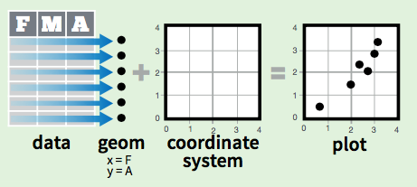
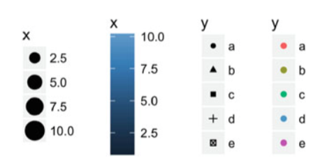
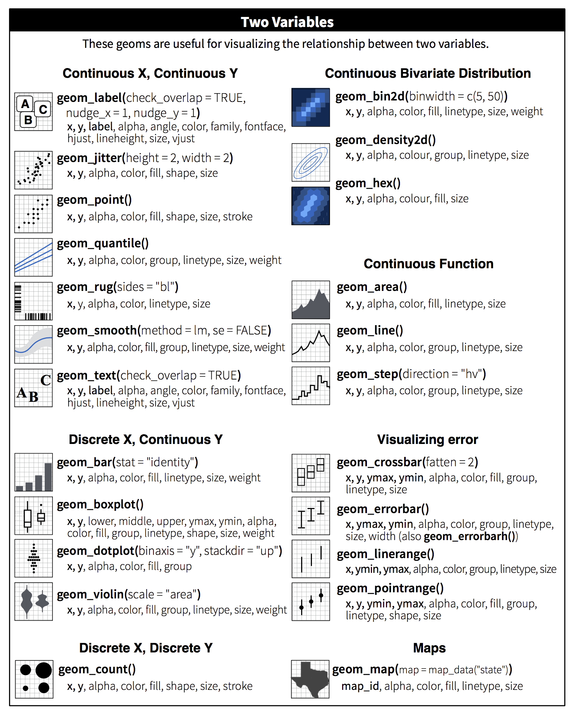

---

> Las notas de este curso introductorio 
> están basadas en el material de los profesores Ernesto Barrios, Andreu Boada,
> Luis Felipe González y Teresa Ortiz.
> Así como en el tutorial del Hadley Wickham y Garret Grolemund
> “R for Data Science”.

---


<br>
<br>
<br>

> “The simple graph has brought more information to the 
> data analyst’s mind than any other device.” — John Tukey

<br>
<br>
<br>


# The Grammar of Graphics (gg)

Se usará el paquete `ggplot2` de Hadley Wickham
para la visualización de datos. 
Este paquete usa los principios de gramática de gráficas 
(por esto "gg") de Leland Wilkinson’s 1999.

```{r gglibrary, eval=T, warning=FALSE, message=FALSE}
library(ggplot2)
library(stringr)
library(readr)
```


### 0. ¿Cómo funciona?

Se incluye un conjunto de datos (data.frame), 
un conjunto de objetos geometricos `geom_` en 
un sistema de coordenadas `(x,y)`. 




<br>


En `ggplot2` se construye la gráfica agregando 
diferentes capas o _layers_,
diferentes tipos de capas que se trataran en este curso
son:

1. **Aesthetic**: `aes()` propiedades de objetos por mapear 
en la gráfica (axis x, axis y, size, shape, color, fill).

2. **Geoms**: `geom_` Objetos geométricos.
Estos objetos se dividen en objetos que mapean 
en una dimensión, dos dimensiones 
y tres dimensiones. 

3. **Transformaciones estadísticas**: `stat_` Resúmen estadístico
de variables. 

4. **Facets**: `facet_` División de gráficas en diferentes paneles 
o subgráficas.

5. **Themes**: `theme()` Aspectos de la gráfica independientes
de los datos, como: fuente, títulos, posición de leyendas y 
fondo. 


Existen dos funciones para graficar: `ggplot` y `qplot`. Aunque 
`qplot` es muy sencilla y similar a `plot`, 
en este curso se pondrá especial antención a
la función `ggplot`. 


Se seguirá el siguiente orden para ejemplificar
distintas gráficas:

* Gráfica de dispersión
* Páneles
* Distintos tipos de gráficas

<br>


### 1. Gráficas de dispersión


Usaremos el conjunto de datos *mpg* que se incluye en R, puedes encontrar 
información de esta base de datos tecleando `?mpg`.

```{r datmpg}
# estructura de la base
str(mpg)
```

<br>

Para realizar una gráfica de dispersión:

1. Se debe especificar
explícitamente que base de datos usamos, 
este es el primer argumento en la 
función `ggplot`

2. Dentro de *aes()* 
escribimos la variable que queremos
graficar en cada eje.

3. Posteriormente se definen las geometrías, 
*_geoms_*, que controlan el tipo de gráfica. 
Así se agrega otra capa a la gráfica
con el símbolo `(+)`.

```{r, fig.width = 5, fig.height = 4}
ggplot(mpg, aes(x = displ, y = hwy)) + 
  geom_point()
```

La forma paralela de graficar con `qplot` se presenta abajo.
```{r, eval = F}
qplot(displ, hwy, data = mpg, geom = 'point')
```


Podemos representar variables adicionales usando otras características estéticas 
(*_aesthetics_*) como forma, color o tamaño.

```{r, fig.width = 6.5, fig.height = 4}
ggplot(mpg, aes(x = displ, y = hwy, color = class)) + 
  geom_point()
```

La forma paralela de graficar con `qplot` se presenta abajo.
```{r, eval = F}
qplot(displ, hwy, color = class, data = mpg, geom = 'point')
```


Ahora se prueba con otras variables estéticas.
```{r, fig.width = 6, fig.height = 4.5}
ggplot(data = mpg) + 
  geom_point(mapping = aes(x = displ, y = hwy, alpha = class))
```

Agregando valores estéticos podemos 
graficar hasta 5 variables en una sola gráfica.
```{r, fig.width = 7.5, fig.height = 5}
mpg$trans <- str_replace( str_extract( mpg$trans, pattern = ".*[(]"), "[(]", "")
ggplot(mpg, aes(x = displ, y = hwy, 
                color = class, shape = trans,
                size = cyl)) + 
  geom_point()
```


<br> 

#### Tipos de variables 

El mapeo de las propiedades estéticas depende del tipo de variable, las 
variables discretas se mapean a 
distintas escalas que las variables continuas:

&nbsp;    |Discreta      |Continua
----------|--------------|---------
Color     |Arcoiris de colores         |Gradiente de colores
Tamaño    |Escala discreta de tamaños  |Mapeo lineal entre el radio y el valor
Forma     |Distintas formas            |No aplica




<br>


En la siguiente gráfica se muestra la variable categórica
*class* reordenada en el eje x.
```{r, fig.width = 5, fig.height = 4}
ggplot(mpg, aes(x = reorder(class, hwy), y = hwy)) + 
    geom_point() 
```

El problema con la gráfica es que no es muy informativa,
por que no se observa variabilidad de los puntos. 
Una forma de corregirla es agregando *vibraciones* o 
*jitter*.
```{r, fig.width = 5, fig.height = 4}
ggplot(mpg, aes(x = reorder(class, hwy), y = hwy)) + 
  geom_point(color = 'red') + 
  geom_jitter()
```

Se mencionó previamente que es posible graficar 
resúmenes estadísticos. En este ejemplo, agregaremos
una capa más con un objeto `boxplot`.
```{r, fig.width = 5, fig.height = 4}
ggplot(mpg, aes(x = reorder(class, hwy), y = hwy)) + 
  geom_point(color = 'red') + 
  geom_jitter() + 
  geom_boxplot(color = 'blue')
```
Nota que cada objeto de cada capa que se agrega tiene
asignado un color diferente. 


#### Modificar elementos

La gráfica tiene diferentes elementos, como: 
texto de los ejes, 
títulos de los ejes, 
títulos de las gráficas,
leyendas de estéticas, etc. Una forma de modificar
el tamaño, color, posición o rotación es mediante la función
`theme()` y `element_text()`.

Por ejemplo, de la base **mpg**  queremos
observar el rendimiento de millas por galón en carretera **hwy**
por cada fabricante **manufacturer**.
```{r, fig.width = 6, fig.height = 4}
ggplot(mpg, aes(x = reorder(manufacturer, hwy), y = hwy)) + 
  geom_point() + 
  geom_jitter() + 
  geom_boxplot() 
```

El problema con la gráfica anterior es 
la dificultad para leer los fabricante, por
lo que se hace una rotación del texto del eje x. 
```{r, fig.width = 6, fig.height = 4}
ggplot(mpg, aes(x = reorder(manufacturer, hwy), y = hwy)) + 
  geom_point() + 
  geom_jitter() + 
  geom_boxplot() +
  theme(axis.text.x = element_text(angle = 90, hjust = 1))
```


Dentro de cada **geom** es posible cambiar distintas
características. Por ejemplo, el color y tamaño 
de cada punto de la gráfica de dispersión. 
```{r, fig.width = 5.5, fig.height = 4}
ggplot(data = mpg) + 
  geom_point(mapping = aes(x = displ, y = hwy), color = "blue", size = 5)
```

¿Por qué la siguiente gráfica no imprime los puntos
en color azul?
```{r, fig.width = 5, fig.height = 3}
ggplot(data = mpg) + 
  geom_point(aes(x = displ, y = hwy, color = "blue"))
```

¿Qué sucede si en la siguiente gráfica agregas 
`legend.position = "none"` o `legend.position = "bottom"`.
```{r, fig.width = 5, fig.height = 3}
ggplot(mpg, aes(displ, hwy)) + 
  geom_point(aes(colour = class)) + 
  theme()
```

¿Qué sucede si en el objeo geométrico de los puntos
incluyes `show.legend = F`?

<br>

> `Ejercicio`:
>
> 1. Importa los datos "conapo.csv" y nombra el dataframe como **conapo**.
> 2. Imprime la estructura de **conapo**.
> 3. ¿Qué sucede si sólo graficas `ggplot(data = conapo)`? 
> ¿Porqué?
> 4. ¿Qué sucede si sólo graficas 
> `ggplot(data = conapo, aes(x = salarios_minimos, y = sin_electricidad))`?
> ¿Porqué?
> 5. Has una tabla de la **Ciudad de México** (CVE_ENT: '09') únicamente y 
> realiza una gráfica de dispersión de **salarios mínimos** y 
> **sin electricidad**. Colorea
> según **analfabeta**. 
> Lee la ayuda de `geom_text()` y agrega una capa con el 
> nombre de cada delegación (NOM_MUN).
> 6. Lee la ayuda de `reorder()`. Realiza una gráfica de dispersión 
> por **entidad federativa** (NOM_ENT) y porcentaje de la población **analfabeta**
> _vibrada_ ordenando por la _mediana_ de __analfabeta__ . 
> 7. Agrega a la gráfica anterior un diagrama de caja y brazos 
> ¿Cómo harías para graficar los puntos encima de las cajas de boxplot?
> A los puntos *vibrados* agregales una transparencia de `0.2`.

> `Respuesta`:

```{r resejscatter, eval = F, echo = T}
# 1. 
library(readr)
conapo <- read_csv('data/conapo.csv')

# 2.
str(conapo)

# 3. 
ggplot(data = conapo)

# 4. 
ggplot(data = conapo, aes(x = salarios_minimos, y = sin_electricidad))

# 5. 
tab.df <- conapo[conapo$CVE_ENT == '09', ]
ggplot(tab.df, 
       aes(x = salarios_minimos, y = sin_electricidad)) + 
  geom_point( aes( color = analfabeta), size = 5) +
  geom_text(aes(label = NOM_MUN), check_overlap = T)

# 6.
ggplot(conapo, aes(x = reorder(NOM_ENT, analfabeta, median), 
                   y = analfabeta)) + 
  geom_point(size = .3) +
  geom_jitter(size = .2) +
  theme(axis.text.x = element_text(angle = 90, hjust = 1))

# 7.
ggplot(conapo, aes(x = reorder(NOM_ENT, analfabeta, median), 
                   y = analfabeta)) + 
  geom_boxplot() + 
  geom_jitter(alpha = .2, size = .3) + 
  theme(axis.text.x = element_text(angle = 90, hjust = 1)) + 
  ylab('Proporción de población analfabeta\nen el muncipio')+
  xlab('Entidad Federativa')
```


<br>
<br>

### 2. Gráficas de pánel

El objetivo de las gráficas de panel es hacer varios múltiplos de una
gráfica, donde cada múltiplo representa un subconjunto de los datos. 
Es una práctica muy útil para explorar relaciones condicionales.

En ggplot una forma es usar la función `facet_wrap()` para hacer paneles dividiendo
los datos de acuerdo a las categorías de una sola variable.

```{r, fig.width = 5, fig.height = 5}
library(ggplot2)
ggplot(mpg, aes(x = displ, y = hwy)) + 
  geom_jitter() +
  facet_wrap(~ class)
```

También podemos hacer una cuadrícula de 2 dimensiones 
usando `facet_grid(filas~columnas)`
```{r, fig.width = 8, fig.height = 3}
ggplot(mpg, aes(x = displ, y = hwy)) + 
  geom_jitter() +
  facet_grid(trans~ class)
```


> `Ejercicio`:
>
> 1. Recrea la siguiente gráfica. ¿Hay algún problema 
> si la variable con la que generas los paneles es numérica?

```{r, fig.width=5, fig.height=2.5, echo = F}
ggplot(mpg, aes(x = displ, y = hwy)) + 
  geom_jitter() +
  facet_wrap(~ year)
```

> 2. ¿Qué gráfica se obtiene del siguientes código? ¿Qué hace `.`?

```{r, eval=FALSE}
ggplot(mpg, aes(x = displ, y = hwy)) + 
  geom_jitter() +
  facet_grid(.~ class)
```

> 3. ¿Qué sucede si en el objeto de panel `facet_wrap()` 
> de la siguiente gráfica agregas `scales = 'free_y'` y
> `nrow = 1`?

```{r, eval=FALSE}
ggplot(mpg, aes(x = displ, y = hwy)) + 
  geom_jitter() +
  facet_wrap(~ class)
```

> 4. Lee los datos 'ingresos.csv'. Crea una variable con valor `TRUE`
> para los salarios que esten por arriba de la mediana y `FALSE`
> para los que no. 
> 5. Grafica el género ordenado por la mediana de ingreso 
> contra el ingreso y divide la gráfica por la variable 
> binaria que creaste en el inciso 4.
> 6. Crea una variable de cortes de edad: menores o igual 35 años y 
> mayores o igual a 35 años. (Tip: Usa la función 
> `cut()`. Vale la pena revisar las funciones
> `cut_interval()` o `cut_number()`)
> 7. Repite la gráfica del inciso 5. pero ahora divide la gráfica 
> por los rangos de edad que acabas de crear. 

>`Respuesta`:

```{r respanel, eval = F, echo = T}
# 1. 
ggplot(mpg, aes(x = displ, y = hwy)) + 
  geom_jitter() +
  facet_wrap(~ year)

# 4.
ingresos <- read_csv("data/ingresos.csv")
ingresos$ingreso_med <- ingresos$ingreso > median(ingresos$ingreso)

# 5. 
ggplot(ingresos,
       aes(x = reorder(genero, ingreso, median),
           y = ingreso)) + 
  geom_point() + 
  geom_jitter() + 
  geom_boxplot()+ 
  facet_wrap(~ingreso_med) + 
  xlab('Género') + 
  ylab('Ingreso')

# 6.
ingresos$edad.cut <- cut(ingresos$edad, breaks = c(0,35,60))

# 7. 
ggplot(ingresos,
       aes(x = reorder(genero, ingreso, median), y = ingreso)) + 
  geom_point() + 
  geom_jitter() + 
  geom_boxplot()+ 
  facet_wrap(~edad.cut)+ 
  xlab('Género') + 
  ylab('Ingreso')
```


<br>
<br>

### 3. Otras Gráficas 


#### Suavizamientos

Al agregar suavizamientos 
se ajusta un modelo a los datos y en la
grafica se imprimen las predicciones 
del modelo. La forma en que se agregan 
es con el objeto geométrico `geom_smooth()`.

En la siguiente gráfica 
para entender con mayor facilidad la gráfica de dispersión 
entre radiación solar y ozono se 
crea una nueva variable de la
velocidad del viento y se agrega un suavizador (loess)
por panel. 

```{r ggsmooth, warning=F, message=F,  fig.width = 8, fig.height = 3.5}
data(airquality)
airquality$Wind.cat <- cut_number(airquality$Wind, 3)
ggplot(airquality, aes(x = Solar.R, y = Ozone)) + 
  geom_point() +
  facet_wrap(~ Wind.cat) + 
  geom_smooth(span = 3)
```


> `Ejercicio:`
>
>¿Qué sucede si en el objeto del suavizamiento 
> de la gráfica anterior
> agregas los siguientes argumentos: `se = F`, `method = "lm"`?

```{r, eval = F}
ggplot(airquality, aes(x = Solar.R, y = Ozone)) + 
  geom_point() +
  facet_wrap(~ Wind.cat) + 
  geom_smooth()
```

<br>

#### Series

En ocasiones se desea ver en alguna secuencia las variables.
Supongamos que queremos ver la tendencia de los nombres
_John_, _Michael_, _Joshua_ y _Christopher_ para niños. 
Para ello se genera un subconjunto de la base de datos.

```{r ggtend, warning=F, message=F,  fig.width = 7, fig.height = 3}
bnames <- read_csv('data/bnames2.csv')
bnames$sex <- factor(bnames$sex, levels = 1:2, labels = c('boy', 'girl'))

sub.bnames <- bnames[bnames$name %in% 
                       c("John", "Michael", "Joshua", "Christopher") & 
                       bnames$sex == 'boy',] 

ggplot(sub.bnames, aes(x = year, y = percent, 
                       color = name, group = name)) +
  geom_line(size = 1) 
```

En esta gráfica se presenta el valor de estética `group` que 
permite agrupar los datos por nombre **name** y para cada nombre
crea una línea con color y tipo (linetype) 
único.

> `Ejercicio:`
>
> ¿Qué sucede si en el objeto de línea `geom_line()` agregas la variable
> `aes(color = name)`? ¿Qué sucede si lo agregas en 
> los valores estéticos iniciales en la función `ggplot`?

```{r, eval = F}
ggplot(sub.bnames, aes(x = year, y = percent, 
                       group = name)) +
  geom_point() + 
  geom_line()
```

<br>


#### Barras 

Las gráficas de barras se generan con el 
objeto `geom_bar()`. Este es uno de los objetos
que hacen transformaciones estadísticas, en este caso 
en particular conteos.


En la siguiente gráfica se muestra el conteo de 
diamantes por cada calidad de corte **cut**.
```{r ggbar, fig.width = 5, fig.height = 3}
ggplot(data = diamonds, 
       aes(x = cut)) + 
  geom_bar()
```

Es posible cambiar el valor estadístico de conteos,
que es el estadístico default,
a los conteos proporcionales con la especificación 
entre `..prop..` como se muestra abajo. Observar 
el eje y.
```{r ggbarprop, fig.width = 5, fig.height = 3}
ggplot(data = diamonds, 
       aes(x = cut, y = ..prop.., group = 1)) + 
  geom_bar()
```

Ahora, también es posible obtener la distribución 
proporcional de cada medida de claridad del diamante 
por corte **cut**. 
```{r ggbarfill, fig.width = 5, fig.height = 3}
ggplot(data = diamonds, 
       aes(x = cut, fill = clarity)) + 
  geom_bar( position = "fill")
```


<br>

#### Histogramas 

Los histogramas muestran la distribución de una 
variable numérica. 
El objeto geométrico para crear histogramas
es `geom_histogram()`. La forma en que funciona este objeto es
cortando la variable y cuenta el número de observaciones
en cada corte. La forma de controlar el ancho 
de los cortes es con el argumento `binwidth`, es 
recomendable jugar con diferentes anchos de corte. 

```{r gghist, fig.width = 5, fig.height = 4, warning=F, message=F}
conapo <- read_csv('data/conapo.csv')
ggplot(data = conapo, aes( x= sin_primaria)) + 
  geom_histogram(binwidth =  5)
```


También se pueden sobre poner distintas distribución 
dependiendo de variables categóricos. 
```{r gghist2, fig.width = 8, fig.height = 4}
sub <- conapo[conapo$CVE_ENT %in% c("09", "07", "30"),]
ggplot(data = sub, aes( x= sin_primaria, fill = NOM_ENT)) + 
  geom_histogram(alpha = .6, 
                 position = 'identity', 
                 binwidth = 3) 
```

**Nota:** También se recomiendan 
los objetos `geom_density()` y `geom_freqpoly()`
muestran distribuciones de variables.


<br>

#### Información estadística


Los siguientes objetos 
resumen información estadística 
con distintas transformaciones. Es por esto que 
no son objetos geométricos, son objetos estadísticos y 
se llaman como `stat_`:

* __QQ-Plot:__ `stat_qq`
Realiza una gráfica cuantil-cuantil de 
una muestra y la distribución teórica. Por default
compara los cuantiles teóricos de la distribución
normal. 

```{r ggquant, fig.width = 5, fig.height = 3}
tab <-  data.frame(
  simulación = rexp(300, rate = 5)
)
ggplot(tab, aes(sample = simulación)) + 
      stat_qq()
```              

En el siguiente ejemplo se modifica para 
comparar con los cuantiles teóricos de la distribución 
exponencial. 
```{r ggquantexp, fig.width = 5, fig.height = 3}
ggplot(tab, aes(sample = simulación)) + 
      stat_qq(distribution = qexp, dparams = 5, 
              color = 'gray40') 
```


* __Distribución acumulada:__  `stat_qq`
Este objeto realiza las transformaciones 
necesarias para presentar la distribución acumulada
de una muestra.

En la siguiente gráfica se compara
la distribución de simulaciones normales con distintos
parámetros.
```{r ggecdf, fig.width = 5, fig.height = 3}
df <- data.frame(x = c(rnorm(100, 0, 3), 
                     rnorm(100, 0, 10)
                     ),
                 g = gl(2, 100))
ggplot(df, aes(x, colour = g)) + 
  stat_ecdf()
```

<br>

#### Funciones

Este objeto permite graficar funciones en un 
rango determinado. El objeto estadístico es
`stat_function()` que tiene como argumento 
una función. 

La siguiente gráfica
muestra una función predeterminada del 
objeto estadístico `dnorm`, que es la distribución
normal con media 2 y desviación 0.5.

```{r ggfunnorm, fig.width = 5, fig.height = 3}
ggplot(data.frame(x = c(-5, 7)), aes(x)) + 
  stat_function(fun = dnorm, args = list(mean = 2, sd = .5))
```

También es posible gráficar cualquier función, como 
en el siguiente ejemplo:
```{r ggfun, , fig.width = 5, fig.height = 3}
FunSin <- function(x){
  sin(x)^2
}
ggplot(data.frame(x = c(-5, 5)), aes(x)) + 
  stat_function(fun = FunSin, size = 1, color = 'salmon')
```


<br>

> `Ejercicio`: 
>
> 1. Recrea el código de R para generar las siguientes
> gráficas.

```{r fig.keep='all', echo=F, fig.width=4, fig.height=2.5}
ggplot(mpg, aes(displ, hwy)) + 
  geom_point() + 
  geom_smooth() + 
  ggtitle('1a')

ggplot(mpg, aes(displ, hwy, group = drv)) + 
  geom_point() +
  geom_smooth(se = F) + 
  ggtitle('1b')

ggplot(mpg, aes(displ, hwy)) + 
  geom_point(aes(colour = drv)) +
  geom_smooth() + 
  ggtitle('1c')

ggplot(mpg, aes(displ, hwy, color = drv)) + 
  geom_point() +
  geom_smooth(method = 'lm', aes(linetype = drv))+ 
  ggtitle('1d')
```

> 2. Importa la base **bnames2.csv** y recrea la siguiente
> gráfica. Únicamente considera los nombres de niña 
> que inician con *Em*. (Tip: usa la función `str_detect()`)

```{r, echo=F, fig.width=9, fig.height=5, warning=FALSE, message=FALSE}
bnames <- read_csv('data/bnames2.csv')
bnames$sex <- factor(bnames$sex, levels = 1:2, labels = c('boy', 'girl'))
ggplot( bnames[ bnames$sex == 'girl' & str_detect(bnames$name, "Em"), ],
        aes(x = year, y = percent, group = name)) +
  geom_line()  + 
  facet_wrap(~name, scales = 'free_y')
```


> `Respuesta`:

```{r, echo=T, eval=F}
# 1a.
ggplot(mpg, aes(displ, hwy)) + 
  geom_point() + 
  geom_smooth() + 
  ggtitle('1a')

# 1b.
ggplot(mpg, aes(displ, hwy, group = drv)) + 
  geom_point() +
  geom_smooth(se = F) + 
  ggtitle('1b')

# 1c.
ggplot(mpg, aes(displ, hwy)) + 
  geom_point(aes(colour = drv)) +
  geom_smooth() + 
  ggtitle('1c')

# 1d.
ggplot(mpg, aes(displ, hwy, color = drv)) + 
  geom_point() +
  geom_smooth(method = 'lm', aes(linetype = drv))+ 
  ggtitle('1d')

# 2.
bnames <- read_csv('data/bnames2.csv')
bnames$sex <- factor(bnames$sex, levels = 1:2, labels = c('boy', 'girl'))
ggplot( bnames[ bnames$sex == 'girl' & str_detect(bnames$name, "Em"), ],
        aes(x = year, y = percent, group = name)) +
  geom_line()  + 
  facet_wrap(~name, scales = 'free_y')
```


<br>

### 4. Resumen de objetos





<br>

### 5. Referencias

- Índice de Marginación 2010. Agosto 2016. [CONAPO]
<http://www.conapo.gob.mx/es/CONAPO/Datos_Abiertos_del_Indice_de_Marginacion>.

- **ggplot2: Elegant Graphics for Data Analysis**. _Hadley Wickham_. 
2nd Edition. Springer. 2016.

- R for Data Visualization. Agosto 2016.
<http://r4ds.had.co.nz/data-visualisation.html>

- Data Visualization with **ggplot2** - Cheat Sheet. Agosto 2016.
<https://www.rstudio.com/wp-content/uploads/2015/03/ggplot2-cheatsheet.pdf>