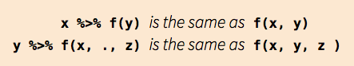

---

> Las notas de este curso introductorio 
> están basadas en el material de los profesores Ernesto Barrios, Andreu Boada,
> Luis Felipe González y Teresa Ortiz.
> Así como en el tutorial del Hadley Wickham y Garret Grolemund
> “R for Data Science”.

---


<br>
<br>
<br>


<br>
<br>
<br>


# 0. Introducción

En esta última sección del taller se concentrará el trabajo en 
la manipulación y tratamiento de los datos. El arte de tener 
tus datos en R listos para visualizar y modelar.

En el diagrama del proceso de análisis de datos (Hadley Wickham) 
de abajo se marcan las tareas que se desarrollarán:


**Importante:** El tema de importación de datos se tocó en la primera
sección, por lo que no se retomará. 

<br>

#### Temas: 

1. Datos limpios y reestructura de datos.
2. Estrategia **split-apply-combine**

<br>

#### Packages

Los paquetes que se usaran en esta sección son:

* `tidyr`: manipulación de datos
* `dplyr`: filtros, cálculos y agregación de datos.

Recuerda que primero es necesario instalar los paquetes
con la función `install.packages()' y el nombre del 
paquete debe ir entre comillas.

```{r installpacks, eval = F}
install.packages('tidyr')
install.packages('dplyr')
```

Una vez instalados en R,
se cargan ambas librerías en conjunto con las
librerías usadas en las secciones anteriores. 

```{r gglibrary, eval=T, warning=FALSE, message=FALSE}
library(tidyr)
library(dplyr)
library(ggplot2)
library(stringr)
library(lubridate)
library(readr)
theme_set(theme_bw())
```

**Recuerda:** Las librerías se cargan en cada sesión
nueva de R que abras. Las librerías se installan 
para cada versión de R nueva. 


<br>

#### Pipeline


La idea de *pipeline* intenta
hacer el desarrollo de código más fácil, en menor 
tiempo, fácil de leerlo, y por lo tanto, 
más fácil mantenerlo.

En el análisis de datos es común hacer
varias operaciones y se vuelve
difícil leer y entender el código. 
La dificultad radica en que usualmente los 
parámetros se asignan después del 
nombre de la función usando `()`. 

La forma en que esta idea logra hacer las cosas 
más faciles es con el operador **forwad pipe** `%>%`que 
envía un valor a una expresión o función. 
Este cambio en el orden funciona como 
el parámetro que precede a la función es enviado ("piped") a 
la función.
Es decir, supongamos `x` es una valor y  sea `f` una función, entonces,
**`x %>% f` es igual a `f(x)`.**


Por ejemplo, sea f(x) la función de probabilidad de la distribución Normal 
con media $\mu = 0$ y desviación estándar $\sigma = 1$:
\[
f(x) = \frac{ 1 }{\sqrt(2\pi)} e^{ (- \frac{1}{2} x^2 )}
\]

```{r magrttrpipe}
f <- function(x){
  exp(-(x^2)/2)/sqrt(2*pi)
} 
# Con operador pipe
4 %>% f
```

que de forma tradicional se realiza:
```{r magrttr}
# Forma tradicional
f(4)
```


En resúmen `%>%` funciona:



**Nota:** El shortcut del pipe `%>%` es command/ctrl + shift + m


> `Ejercicio`:
>
>
> 1. ¿Qué hace el siguiente código? ¿Qué hace `.`?

```{r, eval = F}
df <- data_frame(
  x = runif(5),
  y = rnorm(5)
)
df %>% .$x
df %>% 
  ggplot(data = ., aes(x = x, y = y)) + 
    geom_point()
```

> 2. Imprime usando pipe `%>%` los primeros 10 elementos de `mpg`.

```{r, echo = F, eval= F}
# Respuesta
# 1. Selecciona la base y extrae la columna x y grafica x vs. y.
# En este caso el punto es el dataframe (df) 

# 2. Algunas formas
mpg %>% head(10)
mpg %>% print(n = 10, width = Inf)
```


<br>

#### Tibbles

Tibbles son dataframes con algunas modificaciones 
que permitirán trabajar mejor con los paquetes de
limpieza y manipulación de datos `tidyr` y `dplyr`.

Una diferencia son los tipos de columnas que maneja: 

* `lgl:` verctore de valores logicos, vectores que contienen TRUE o FALSE.
* `int`: vectores de números enteros.
* `dbl`: vectores de número reales.
* `chr`: vectores de caracteres, *strings*.


> `Ejercicio`:
>
> 1. Imprime `ds` y `as.data.frame(ds)` ¿Cuál es la diferencias entre ambas?

```{r, eval = F}
ds <- tbl_df(mtcars)
ds
as.data.frame(ds)
```

**Nota:** Para más información de este tipo de dataframes
consulta la libreria `tibble`.


<br>

# 1. Datos limpios 

Los datos limpios son datos que facilitan las tareas del análisis de datos:

* __Manipulación__: Manipulación de variables como agregar, filtrar, reordenar, transformar.
* __Visualización__: Resúmenes de datos usando gráficas, análisis exploratorio, 
o presentación de resultados.
* __Modelación__: Ajustar modelos es sencillo si los datos están en la forma correcta.

<br>

### Principios:

Los principios de datos limpios 
([Tidy Data de Hadley Wickham]<http://vita.had.co.nz/papers/tidy-data.pdf>) 
proveen una manera estándar de organizar la información:

1. Cada variable forma una columna.
2. Cada observación forma un renglón.
3. Cada tipo de unidad observacional forma una tabla.


**Nota:** La mayor parte de las bases de datos en estadística 
tienen forma rectangular por lo que únicamente se trataran
este tipo de estructura de datos. 


Una **base de datos** es una colección de valores numéricos o 
categóricos. 
Cada valor pertenece a una variable y a una observación. 
Una **variable** contiene los valores del atributo (genero, fabricante, ingreso) 
de la variable por unidad. Una **observación**
contiene todos los valores medidos por la misma 
unidad (personas, día, autos, municipios) 
para diferentes atributos.

<br>

### Ejemplo:

Supongamos un experimento con 3 pacientes 
cada uno tiene resultados de 
dos tratamientos (A y B):


||tratamientoA|tratamientoB
----|------------|---------
Juan Aguirre|- |2
Ana Bernal  |16|11
José López  |3 |1


La tabla anterior también se puede estructurar de la siguiente manera:

 ||Juan Aguirre| Ana Bernal|José López
--|------------|-----------|----------
tratamientoA|- |    16     |   3
tratamientoB|2 |    11     |   1


Si vemos los principios ¿las tablas anteriores los cumplen?
Para responder la pregunta veamos:

- **¿Cuáles son los valores?**
En total se tienen 18 valores en el conjunto de datos. 

- **¿Cuáles son las variables?**
Se tienen tres variables: 

1. Persona/nombre: Juan Aguirre, Ana Bernal, y José López
2. Tratamiento: A y B 
3. Resultado: -, 2, 16, 11, 3, 1

- **¿Cuáles las observaciones?**
Existen 6 observaciones.  


Entonces, siguiendo los principios de _datos limpios_ obtenemos la siguiente estructura: 

nombre|tratamiento|resultado
------------|-----|---------
Juan Aguirre|a    |-
Ana Bernal  |a    |16
José López  |a    |3
Juan Aguirre|b    |2
Ana Bernal  |b    |11
José López  |b    |1

<br>

Una vez que identificamos los problemas de una base de datos podemos proceder a la limpieza.


###  Funciones principales:

Para la limpieza de datos usaremos la librería `tidyr` como ya se mencionó
y 4 funciones principales del paquete:

* `gather()`: junta columnas en renglones. También se le conoce 
como *melt*, derretir la base.
Recibe múltiples columnas y las junta en pares de nombres y 
valores, convierte los datos anchos en largos.  

`tidyr::gather(data, key = name_variablelabel, value = name_valuelabel, select_columns)`


* `spread()`: separa renglones en columnas. Recibe dos columnas
y las separa, haciendo los datos más anchos.

`tidyr::spread(data, key = name_variablelabel, value = name_valuelabel)`


* `unite()`: une varias columnas en una sola. 


* `separate()`: separa una columna en varias columnas.

`tidyr::separate(data, col = name_variabletoseparate, into = c(vector with names using ""), sep)`


Otras funciones útiles:

* `arrange()`: ordena un dataframe de acuerdo a variables específicas.
* `rename()`: permite ronambrar variables.
* `select()`: selecciona variables.


Estas funciones se ejemplificaran en algunos de los 
problemas más comunes que se encuentran 
en conjuntos de datos sucios y se mostrará como se puede manipular 
la tabla de datos con el fin de estructurarla para que 
cumpla los principios de datos limpios.


<br>

### Problemas comúnes:

Algunos de los problemas más comunes en las bases de datos que no están _limpias_ son:

a. Los encabezados de las columnas son valores y no nombres de variables. 
b. Más de una variable por columna. 
c. Las variables están organizadas tanto en filas como en columnas. 
d. Más de un tipo de observación en una tabla.
e. Una misma unidad observacional está almacenada en múltiples tablas. 


<br>

#### <span style="color:darkblue">a. Encabezados de columnas son valores</span>

Usaremos ejemplos para entender los conceptos más facilmente.
La primer base de datos está basada en una encuesta de [Pew Research](http://www.pewforum.org/2009/01/30/income-distribution-within-us-religious-groups/) 
que investiga la relación entre ingreso y afiliación religiosa.
¿Cuáles son las variables en estos datos?

```{r aleerdatos}
# leemos la base
pew <- read.delim(file = "http://stat405.had.co.nz/data/pew.txt",
  header = TRUE, stringsAsFactors = FALSE, check.names = F)
pew %>% str()
```

Para _limpiarla_ es necesario apilar las columnas, es decir, alargar los datos. 
Esto lo realizaremos con la función `gather()` y los siguientes argumentos
`tidyr::gather(data, key = name_variablelabel, value = name_valuelabel, select_columns)`:

```{r along}
pew.long <- pew %>% 
  gather(income, frequency, -religion)
# vemos las primeras líneas de nuestros datos alargados 
head(pew.long) 
```

La nueva estructura de la base de datos nos permite, por ejemplo, hacer 
fácilmente una gráfica donde podemos comparar las diferencias en las 
frecuencias. 

```{r aggplot, fig.height = 4.5, fig.width = 8.5, warning = FALSE}
ggplot(pew.long, aes(x = income, y = frequency, 
                     color = religion, group = religion)) +
  geom_line(size = 1) + 
  theme(axis.text.x = element_text(angle = 90, hjust = 1)) +
  guides(color = guide_legend(ncol=2))
```


<br>

#### <span style="color:darkblue">b. Más de una variable por columna</span>

La siguiente base de datos proviene de la Organización Mundial de la Salud y 
contiene el número de casos confirmados de tuberculosis por país y año, la
información esta por grupo demográfico de acuerdo a sexo (m, f), y
edad (0-4, 5-14, etc). 

```{r bleerdatos, message=F, warning=F}
tb <- read.csv("data/tb.csv") %>% tbl_df()
print(tb, n = 10, width = NULL)
```

De manera similar al inciso a., 
utilizando la función `gather()` se busca apilar las 
columnas correspondientes a sexo-edad.
**¿Cómo podemos separar la "variable" sexo-edad en dos columnas?**

```{r blong}
tb.long <- tb %>%
  gather(demog, casos, new_sp_m04:new_sp_fu, na.rm=TRUE)
  # gather(demog, casos, c(-iso2, -year), na.rm=TRUE) # otra forma 
print(tb.long, n= 6)
```


Las variables sexo y edad se obtienen separando la columna **demog**, 
para esto se usa la función `separate()`con los siguientes argumentos:
`tidyr::separate(data, col = name_variabletoseparate, into = c(vector with names using ""), sep)`

```{r btidy}
tb.tidy <- tb.long %>% 
  separate(col = demog, into = c("sex", "age"), sep = 8)
tb.tidy
```

Ahora para hacer mejor variable **sex** y **age** usaremos la función 
`mutate()` que permite crear nuevas variables sin modificar la 
dimensión del dataframe.

```{r bmutate}
tb.tidy <- tb.long %>% 
  separate(col = demog, into = c("sex", "age"), sep = 8) %>% 
  mutate( sex = str_sub(sex, 8, 8), 
          age = factor(age, 
                       levels = c("014", "04", "1524", "2534", "3544",
                                  "4554", "514",  "5564", "65","u"),
                       labels = c("0-14", "0-4", "15-24", "25-34", "35-44",
                                  "45-54", "5-14",  "55-64", "65+","unknown")
                       )
          )
print(tb.tidy, n = 6)
```


<br>

#### <span style="color:darkblue">c. Variables almacenadas en filas y columnas</span>

Uno de los problemas más difícil es cuando las variables están tanto en filas como en 
columnas. Para este problema veamos una base de datos 
de Global Historical Climatology Network que contiente el 
clima por día en Cuernavaca (estación MX17004).
¿Cuáles son las variables en estos datos?

```{r cleerdatos}
clima <- read.delim("data/clima.txt", stringsAsFactors=FALSE) %>% tbl_df()
print(clima, n = 4)
```

Estos datos tienen variables en columnas individuales (id, año, mes), en 
múltiples columnas (día, d1-d31) y en filas (tmin, tmax). Comencemos por apilar 
las columnas.

```{r clong}
clima.long <- clima %>%
  gather(day, value, d1:d31, na.rm = TRUE)
head(clima.long)
```

Podemos crear algunas variables adicionales con las 
funciones `tidyr::extract_numeric()`, `tidyr::select()` y 
`dplyr::arrange()`.

```{r cvars}
clima.vars <- clima.long %>% 
  mutate(day = extract_numeric(day), value = value / 10)  %>%
  select(id, year, month, day, element, value) %>%
  arrange(id, year, month, day)
head(clima.vars)
```

Finalmente, la columna **element** no es una variable, sino que almacena el nombre 
de dos variables, la operación que debemos aplicar la función 
`spread()` que es el inverso de apilar `gather()`, 
la función usa los siguientes argumentos:
`tidyr::spread(data, key = name_variablelabel, value = name_valuelabel)`
  
```{r ctidy}
clima.tidy <- clima.vars %>%
  spread(element, value) 
head(clima.tidy)
```

Ahora es inmediato no solo hacer gráficas sino también ajustar un modelo.

```{r cmodel}
# ajustamos un modelo lineal donde la variable respuesta es temperatura 
# máxima, y la variable explicativa es el mes
clima.lm <- lm(TMAX ~ factor(month), data = clima.tidy)
summary(clima.lm)
```

<br>

#### <span style="color:darkblue">d. Mas de un tipo de observación en una misma tabla</span>

En ocasiones las bases de datos involucran valores en diferentes niveles, en 
diferentes tipos de unidad observacional. En la limpieza de datos, cada unidad
observacional debe estar almacenada en su propia tabla 
(esto esta ligado a normalización de una base de datos), 
es importante para evitar inconsistencias en los datos.


Para este caso se usará la base de datos Billboard Top 100 del año 2000, 
que incluye las variables: artist, track, rank and week. El ranking
se registra cada semana despues de entrar al top 100 (wk1 a wk75).
```{r dleerdatos}
billboard <- read.csv('data/billboard.csv') %>% tbl_df()
head(billboard)
```

La instrucción `na.rm = TRUE` se utiliza para eliminar los valores faltantes en 
las columnas **wk1** a **wk76**. Realizamos una limpieza adicional creando mejores 
variables de fecha y duración.

```{r dtidy}
billboard.tidy <- billboard %>% 
  gather(week, rank, wk1:wk76, na.rm=TRUE) %>%
  mutate(
    week = extract_numeric(week), # tidyr: número de semana
    date = as.Date(date.entered) + (7 * (week - 1)) # lubriate: operaciones de fechas
    ) %>%
  select(-date.entered)
```

Separemos esta base de datos en las dos variables que tenemos:
duración de la canción **time** 
y ranking de la canción en cada semana **rank**. 

La primera tabla **song** almacena artista, 
nombre de la canción y duración. Además se 
agrega una variable **song_id**.

```{r dtab1, warning=F, message=F}
library(forcats)
song <- billboard.tidy %>% 
  select(artist, track, year, time) %>%
  unique() %>%
  mutate(song_id = row_number(artist),
         time.ms = ms(time), 
         # lubridate: duracion en minutos y segundos
         time.secs = as.numeric(minute(time.ms))*60 + 
           as.numeric(seconds(time.ms)), 
         # forcats: recodificación de artistas top 5 con mas canciones en el rank
         artist.top = fct_lump(artist,n = 1)
        
    ) %>% 
  select(-time.ms)
dim(song)
song
```

La segunda tabla **rank** 
almacena el ranking de la canción en cada semana 
por **song_id**.
```{r dtab2}
rank <- billboard.tidy %>%
  left_join(song, by = c("artist", "track", "year", "time")) %>%
  select(song_id, artist, date, rank) %>% 
  arrange(song_id, date) 
dim(rank)
rank
```

Para crear la segunda tabla se usa une la tabla 
**song** a **billboard.tidy** y se agregan las variables 
**song_id** y **time_ms**.

La función `left_join()` tiene los siguientes argumentos:
`dplyr::left_join(x, y, by = c(vector de variables por las que unir ""))` que une
dos tablas: `x` y `y`. Pega `y` a `x` de tal forma que regresa todos los
renglones de `x` y todas las columnas de `x` y `y`.


Así es posible hacer gráficas facilmente para cada variable.

* Distribución de la duración de canciones del Top 100 en 2000:
```{r dggplot1, fig.width= 5, fig.height=2}
ggplot(song, aes(x = 'total', y = time.secs)) + 
  geom_boxplot() + 
  scale_y_continuous(labels = function(x) round(x/60)) + 
  ylab('duración de canción') + 
  xlab(NULL) + 
  coord_flip()
```

* Artista con más canciones en Top 100 de 2000:
```{r dggplot2, fig.width= 8, fig.height=3.5}
tracks <- rank %>%
  inner_join(song %>%  filter(artist.top != 'Other'))
ggplot(tracks, aes(x = date, y = rank, 
                   group = track, color = track)) +
  geom_line() + 
  ggtitle( unique(tracks$artist))
```

* Boy bands de mi adolescencia en 2000:
```{r dggplotbsb, fig.width= 11, fig.height=3.5}
tracks.boyband <- rank %>%
  inner_join( filter(song, 
                     artist %in% c('Backstreet Boys, The', "N'Sync") ) 
              )
ggplot(tracks.boyband, aes(x = date, y = rank, 
                   group = track, color = track)) +
  geom_line() + 
  facet_wrap(~artist) 
```

```{r dggplotbsb2, fig.width= 8, fig.height=3}
ggplot(tracks.boyband, aes(x = date, y = rank, 
                   group = track, color = artist)) +
  geom_line() 
```

<br>

#### <span style="color:darkblue">e. Una misma unidad observacional almacenada en varias tablas</span>

También es común que los valores sobre una misma unidad
observacional estén separados en muchas tablas o archivos (INEGI),
es común que estas tablas esten divididas 
de acuerdo a una variable, de tal manera que cada archivo representa a una 
persona, año o ubicación. Para juntar los archivos hacemos lo siguiente:

1. Leemos los archivos en una lista de tablas. 
2. Para cada tabla agregamos una columna que registra el nombre del archivo original. 
3. Combinamos las tablas en un solo data frame.  

Veamos un ejemplo, la carpeta **specdata** contiene 332 archivos csv que almacenan
información de monitoreo de contaminación en 332 ubicaciones de EUA. Cada 
archivo contiene información de una unidad de monitoreo y el número 
de identificación del monitor es el nombre del archivo.

* Creamos un vector con los
nombres de los archivos en un directorio, 
eligiendo aquellos que contengan las
letras *".csv"*.

```{r epaths}
paths <- dir("data/specdata", pattern = "\\.csv$", full.names = TRUE)
```

* Creamos una función para leer los archivos .csv y se 
itera por cada path con la función `lapply()`. Esto devuelve
una lista y unimos las tablas con la función `rbind_all()` de
`dplyr`. Finalmente, se crean nuevas variables.

```{r eleerdatos, eval = F, warning=FALSE, message=FALSE}
ReadCsvPath <- function(path){
  tab <- read.csv(file = path, stringsAsFactors = FALSE)
  tab$monitor <- extract_numeric(path)
  tab
}
specdata <- lapply(paths, ReadCsvPath) %>% 
  rbind_all() %>% 
  tbl_df() %>%
  mutate(
    date = as.Date(Date)) %>%
  select(id = ID, monitor, date, sulfate, nitrate)
head(specdata)
```

<br>

#### <span style="color:darkblue">f. Otras consideraciones</span>

En las buenas prácticas es importante tomar en cuenta los siguientes puntos:
  
* Incluir un encabezado con el nombre de las variables.
* Los nombres de las variables deben ser entendibles 
(e.g. AgeAtDiagnosis es mejor que AgeDx).
* En general los datos se deben guardar en un archivo por tabla.
* Escribir un script con las modificaciones que se hicieron a los _datos crudos_ 
(reproducibilidad).
* Otros aspectos importantes en la _limpieza_ de datos son: selección del tipo de
variables (por ejemplo fechas), datos faltantes, _typos_ y detección de valores
atípicos.


<br>


> `Ejercicio:`

> I. Obten los datos del problema común **e. specdata**
> y obten **una** gráfica de la serie por tipo de medida:
> **nitrate** y **sulfate** para un monitor cualquiera.
> Coloreando cada serie por tipo de medida.
> Agrega la siguiente función `scale_y_log10()` a la 
> gráfica anterior ¿qué sucede?

> II. Importa la tabla de frecuencias **tabej1.csv** 
> de adopciones por tipo animal de un refugio. 
> Realiza una tabla de forma ancha para la frecuencia **n**
> y otra para la proporción **prop**. Renombra la columna
> categórica: **outcomtype frecuencia** o **outcomtype proporción** 
> a las columnas dependiendo de la tabla. 

> III. Para este ejercicio vamos a usar 
> datos sobre edad en años de perros y gatos adpotados del refugio 
> de Austin Animal Center. Los datos fueron tomados de
> ASPCA. La base se llama **adoptions2.csv**. 
> 
> Esta tabla tiene información de varias variables en 
> una variable y valores en variables:
> a. Obten la forma larga de la base.
> b. Separa **sexuponoutcome** para obtener una
> variable del sexo del animal. (Tip: usa la función `separate()`)


> IV. Para seguir practicando:
>
> * Usando la base **billboard.csv** evalúa el efecto
> Britney Spears vs. Christina Aguilera.
>
> * Descarga la base de mortalidad en México e 
> intenta graficar el número de muertes por hora
> en el año 2008. 
> ¿Qué observas?

```{r, echo=T, eval=F}
src <- "https://github.com/hadley/mexico-mortality/raw/master/deaths/deaths08.csv.bz2"
download.file(url = src, "data/deaths.csv.bz2", quiet = TRUE)
```


```{r echo = F, eval = F}
# • I.
paths <- dir("data/specdata", pattern = "\\.csv$", full.names = TRUE)
ReadCsvPath <- function(path){
  tab <- read.csv(file = path, stringsAsFactors = FALSE)
  tab$monitor <- readr::parse_numeric(path)
  tab
}
specdata <- lapply(paths, ReadCsvPath) %>% 
  rbind_all() %>% 
  tbl_df() %>%
  mutate(
    date = as.Date(Date)) %>%
  select(id = ID, monitor, date, sulfate, nitrate)
head(specdata)

tt <- filter(specdata, monitor ==  1) %>% 
  gather(var.lab, var.num, sulfate:nitrate) %>% 
  filter(!is.na(var.num))
ggplot(tt, aes(x = date, y = var.num, 
               color = var.lab, group = var.lab))+ 
  geom_line() + 
  scale_y_log10()

# • II.
tt <- read_csv("data/tabej1.csv") 
tt %>% 
  select(-prop) %>% 
  spread(animaltype, n) %>% 
  rename(`outcomtype frecuencia` = outcometype)
tt %>% 
  select(-n) %>% 
  spread(animaltype, prop) %>% 
  rename(`outcomtype proporción` = outcometype)

# • III.
adoptions <- read_csv('data/adoptions2.csv')  
# Manipulación
tt <- adoptions %>% 
  gather(animaltype, age.yrs, Cat:Dog, na.rm = T) %>% 
  separate(sexuponoutcome, c('state.outcome', 'gender'), 
           sep = ' ', remove = T) %>% 
  mutate(wdays = weekdays(datetime, abbreviate = T),
         mths = months(datetime, abbreviate = T)
         ) %>% 
  select(animalid, outcometype, animaltype, 
         state.outcome, gender,wdays, mths, age.yrs)

```


<br>


---

<br>

# 2. Split - Apply - Combine

Muchos problemas de análisis de datos involucran la aplicación de la estrategia
**divide-aplica-combina** ([Hadley Whickam, 2011](http://www.jstatsoft.org/v40/i01/paper)). 
Esta consiste en romper un problema en pedazos (de acuerdo a una variable de interés), 
operar sobre cada subconjunto de manera independiente
(ej. calcular la media de cada grupo, ordenar observaciones por  
grupo, estandarizar por grupo) y después unir los pedazos nuevamente. 

El siguiente diagrama ejemplifiaca el paradigma de divide-aplica-combina:
  


<br>

1. **Separa** la base de datos original.  
2. **Aplica** funciones a cada subconjunto.  
3. **Combina** los resultados en una nueva base de datos.


Cuando pensamos como implementar la estrategia divide-aplica-combina es 
natural pensar en iteraciones, por ejemplo utilizar un ciclo `for`
para recorrer cada grupo de interés y aplicar las funciones. 
Sin embargo, la aplicación de ciclos `for` desemboca en 
código difícil de entender. Adicionalmente, `dplyr` es mucho más veloz.

Estudiaremos las siguientes funciones:
  
* **filter**: obten un subconjunto de las filas de acuerdo a un criterio.
* **select**: selecciona columnas de acuerdo al nombre.
* **arrange**: reordena las filas.
* **mutate**: agrega nuevas variables.
* **summarise**: reduce variables a valores (crear nuevas bases de datos).

Estas funciones trabajan de manera similar, el primer argumento que reciben 
es un _data frame_ (usualmente en formato *limpio*), los argumentos que siguen
indican que operación se va a efectuar y el resultado es un nuevo _data frame_.

Veamos con ejemplos con la siguiente 
ase de datos sencilla para mostrar el funcionamiento de cada
instrucción.
  
```{r sacdfej}
df_ej <- data.frame(genero = c("mujer", "hombre", "mujer", "mujer", "hombre"), 
                    estatura = c(1.65, 1.80, 1.70, 1.60, 1.67))
df_ej
```


<br>

#### - Filtrar

Filtrar una base de datos dependiendo de una condición 
requiere la función `filter()` que
tiene los siguientes argumentos
`dplyr::filter(data, condition)`. 

```{r filtejem}
filter(df_ej, genero == "mujer")
filter(df_ej, estatura > 1.65 & estatura < 1.75)
```

Algunos operadores importantes para filtrar son:  
```{r, eval = FALSE}
x > 1
x >= 1
x < 1
x <= 1
x != 1
x == 1
x %in% ("a", "b")

# Conjuntos
a | b
a & b
a & !b
xor(a, b)
```


<br>

#### - Seleccionar

Elegir columnas de un conjunto de datos
se puede hacer con la función `select()` que
tiene los siguientes argumentos
`dplyr::select(data, seq_variables)`. 

```{r selejemp}
df_ej
select(df_ej, genero)
select(df_ej, -genero)
```

También, existen funciones que se usan 
exclusivamente en `select()`:

- `starts_with(x, ignore.case = TRUE)`: los nombres empiezan con _x_.
- `ends_with(x, ignore.case = TRUE)`: los nombres terminan con _x_.
- `contains(x, ignore.case = TRUE)`: selecciona las variable que contengan _x_.
- `matches(x, ignore.case = TRUE)`: selecciona las variable que igualen la expresión regular _x_.
- `num_range("x", 1:5, width = 2)`: selecciona las variables (numericamente) de x01 a x05.
- `one_of("x", "y", "z")`: selecciona las variables que esten en un vector de caracteres.
- `everything()`: selecciona todas las variables.

Por ejemplo:
```{r selejem, eval = FALSE}
select(df_ej, starts_with("g"))
select(df_ej, contains("g"))
```

<br>

#### - Arreglar

Arreglar u ordenar de acuerdo al valor de una o más variables
es posible con la función `arrange()` que tiene los siguientes argumentos
`dplyr::arrange(data, variables_por_las_que_ordenar)`. 
La función `desc()` permite que se ordene de forma descendiente. 
  
```{r arrejem}
arrange(df_ej, genero)
arrange(df_ej, desc(estatura))
```

<br>

#### - Mutar
Mutar consiste en crear nuevas variables 
con la función `mutate()` que tiene los siguientes
argumentos `dplyr::mutate(data, nuevas_variables = operaciones)`:

```{r mutaejem}
mutate(df_ej, estatura_cm = estatura * 100) 
mutate(df_ej, 
       estatura_cm = estatura * 100, 
       estatura_in = estatura_cm * 0.3937) 
```

<br>

#### - Resúmenes por Grupo

Los resúmenes permiten crear nuevas bases de datos
que son agregaciones de los datos originales. La función `summarise()`
permite realizar este resúmen 
`dplyr::summarise(data, nuevas_variables = operaciones)`:

```{r summejem}
dplyr::summarise(df_ej, promedio = mean(estatura))
```

También es posible hacer resúmenes agrupando por 
variables determinadas de la base de datos. Pero, 
primero es necesario crear una base agrupada con 
la función `group_by()` con argumentos
`dplyr::group_by(data, add = variables_por_agrupar)`:
  
```{r summgrpejem}
by_genero <- group_by(df_ej, genero)
by_genero
```

Después se opera sobre cada grupo, 
creando un resumen a nivel grupo y uniendo los 
subconjuntos en una base nueva:
  
```{r summresumen}
dplyr::summarise(by_genero, promedio = mean(estatura))
```

Algunas funciones útiles con _summarise_ son min(x), median(x), max(x), 
quantile(x, p), n(), sum(x), sum(x > 1), mean(x > 1), sd(x).

Una de las funciones más útiles es la función `do()`. Esta función
permite realizar calculos que regresan otro dataframe u objetos
en una lista. Es muy útil cuando se trabaja con modelos, a continuación 
se da un ejemplo:

```{r summdo}
models <- mpg %>% 
  group_by(manufacturer) %>%
  do(mod = lm(hwy ~ displ, data = .))
models
```

```{r summdocoefs, fig.width=4.5, fig.height=4, warning=FALSE, message=FALSE}
tab.coefs <- lapply(models$mod, function(mod){ data.frame(t(coef(mod))) }) %>% 
  rbind_all() %>% 
  rename(intercept = `X.Intercept.`) %>% 
  mutate(manufacturer = models$manufacturer)
  
ggplot(tab.coefs, aes(x = intercept, y = displ, 
                      color = manufacturer)) +
  geom_text(aes(label = manufacturer),
            check_overlap = F,
             show.legend = F) + 
  geom_point(show.legend = F, size = 1) 
```


<br>


<br>


> `Ejercicio:`

> I. De los datos obtenidos de adopciones que ya trabajaste en 
> el ejercicio anterior para tenerla en forma *limpia*, ahora 
> podemos analizar:
>
> a. Obten el día de la semana y el mes en el que el animal 
> fue adoptado.
> b. Realiza una gráfica de dispersión con suavizamiento de días de la semana
> por número de salidas coloreando por tipo de salida.
> (Tip: Obten una tabla de frecuencias por **weekday** y **outcometype** usando
> las funciones `group_by()` y `tally()`)
> c. Una vez que tienes la tabla de frecuencias
> intenta adaptar el código para que puedas obtener 
> la gráfica de calor. ¿Qué observas?
> d. Únicamente para los animales adoptados:
> - Histograma de la edad de adopción
> - Histograma de la edad de adopción por género
> - Boxplot de la edad de adopción por tipo de animal

```{r eval = F}
ggplot(tab.freq, 
       aes(x = outcometype, y = wdays, 
           fill = n)) + 
  geom_tile(colour = "white") + 
  scale_fill_gradient(low = "white", high = "steelblue") + 
  ylab(NULL) + xlab(NULL) + 
  ggtitle('Tipos de Egresos')
```

```{r echo=F, eval=F}
# Análisis
# 1. Días con mayor salidas y tipo de salida
# a. 
tt <-  tt %>% 
  mutate(wdays = weekdays(datetime, abbreviate = T),
         mths = months(datetime, abbreviate = T)
         )

# b.
tt$wdays <- factor(as.character(tt$wdays), 
                   levels = c("Mon", "Tue", "Wed", "Thu", "Fri", "Sat", "Sun"))
tab.freq <-  tt %>% 
  select(outcometype, wdays, animalid) %>% 
  group_by(outcometype, wdays) %>% 
  tally
ggplot(tab.freq, 
       aes(x = wdays, y = n, 
           color = outcometype, group = outcometype)) + 
  geom_point(alpha = .3) +
  geom_smooth(se = F, span = 2)

# b. Heatmap
ggplot(tab.freq, 
       aes(x = outcometype, y = wdays, fill = n)) + 
  geom_tile(colour = "white") + 
  scale_fill_gradient(low = "white", high = "steelblue") + 
  ylab(NULL) + xlab(NULL) + 
  ggtitle('Tipos de Egresos')

# c. Solo adopciones
tt.adopt <- filter(tt, outcometype == 'Adoption')

# Histograma de la edad de adopción
ggplot(tt.adopt, aes(x = age.yrs))+ 
  geom_histogram(bins = 9)

# Comportamiento de la edad de adopción por género
ggplot(tt.adopt, aes(x = age.yrs, fill = gender))+ 
  geom_histogram( position = 'dodge', 
                  bins = 6, alpha = .5)

# Comportamiento de la edad de adopción por tipo de animal
ggplot(tt.adopt, aes(x = animaltype, y = age.yrs))+ 
  geom_boxplot(notch = T)

# Extra: Meses con mayor salidas y tipo de salida
tab.freq <-  tt %>% 
  select(outcometype, mths, animalid) %>% 
  group_by(outcometype, mths) %>% 
  tally 
ggplot(tab.freq, 
       aes(x = mths, y = n, 
           color = outcometype, group = outcometype)) + 
  geom_point(alpha = .3) +
  geom_smooth(se = F, span = 2)
```


<br>

# 3. CASO NYC FLIGHTS

> Para el siguiente ejercicio se usará el paquete
> `nycflights13`. Este paquete incluye los datos de los vuelos que salieron
> de NYC (EWR, JFK and LGA) en 2013. Además tiene información complementaria
> de el clima, aerolíneas, aviones y aeropuertos. 
>
> El paquete se compone de 5 tablas:
>
>* `flight`: información de los vuelos.
>* `weather`: datos meteorológicos por hora por aeropuerto.
>* `planes`: información de construcción de cada avión.
>* `airports`: localización y nombre de aeropuertos. 
>* `airlines`: codigos de nombre de aerolínea.
>
> Total de vuelos: 336,776.

```{r nycfdatos, eval = F}
library(nycflights13)
```

> El siguiente diagrama muestra variables con las que se conectan
> las diferentes tablas. 


> Se desea saber:
>
>- Todos los vuelos hacia SFO ó OAK.
>- ¿Cuáles son los diez vuelos con mayor retraso de salida?
>¿Cuál es el nombre de las aerolíneas son y a qué destino se dirigen?
>- Se quiere saber si existe relación de distacia y retraso promedio por cada destino.
> Considera quitar 'datos ruidosos', ¿qué vuelos consideras atípicos? ¿Crees que
>se deban de quitar destinos con pocos vuelos del análisis?
>- ¿Qué destinos tienen mayor número de aerolíneas con la ruta?
>¿Cuál es el nombre completo de las 
> aerolíneas que vuelan en la ruta con más aerolíneas? 
>- ¿Existe relación entre el tiempo promedio de retraso y 
>el mes del año? ¿Se observa relación con el número de vuelos
>por mes? ¿Cómo lo presentarías en una sola gráfia?
>-Observa el número de vuelos cancelados por día. 
> ¿Existe un patrón? ¿Está relacionada la proporción de 
> vuelos con al retraso promedio del día? 
>- ¿A qué hora es recomendable volar si quieres evitar
> retrasos en la hora de salida?


<br> 

**Recomendación:** Si normalmente trabajas con 
datos grandes (por ejemplo 10-100 Gb), 
se recomienda la libreria `data.table`. En este caso 
únicamente trataremos datos ligeros, pero todas las funciones
que trataremos para la manipulación son aplicables a 
datos de `data.table`.

<br>

<br>

# 4. Referencias

- **Tidy Data**. _Hadley Wickham_. 
Journal of Statistical Software. August 2014, Volume 59, Issue 10.
<https://www.jstatsoft.org/article/view/v059i10>

- R for Data Analysis. Septiembre 2016.
<http://r4ds.had.co.nz/wrangle-intro.html>

- Data Wrangling with **tidyr** and **dplyr** - Cheat Sheet. Septiembre 2016.
<https://www.rstudio.com/wp-content/uploads/2015/02/data-wrangling-cheatsheet.pdf>

- Cheatsheet for **dplyr* Join Functions. Septiembre 2016.
<http://stat545.com/bit001_dplyr-cheatsheet.html>

- NYC Flights 2013. Septiembre 2016. 
<https://github.com/hadley/nycflights13>

- Mortality data for Mexico. Septiembre 2016.  
<https://github.com/hadley/mexico-mortality/raw/master/deaths/deaths08.csv.bz2>

- Kaggle Shelter Animal Outcomes. Septiembre 2016.  
<https://www.kaggle.com/c/shelter-animal-outcomes>